  

# ⚡ Awesome LLM Gateway & AI Proxy Ecosystem 🚀

  
  
  
  
  
  
  

**A curated, production-ready directory of leading SaaS Platforms and Open-Source LLM Gateways, AI Proxies, and Model Routers.**

*Unified multi-model routing, load balancing, dynamic fallbacks, semantic caching, budget & rate-limit enforcement, prompt guardrails, and real-time LLMOps observability.*

📅 **Last updated: September 2026**

---

## 📖 Overview

An **LLM Gateway** (also known as an **AI Gateway** or **LLM Proxy**) acts as an intelligent control plane and single OpenAI-compatible reverse proxy sitting between client applications and downstream foundation model providers (OpenAI, Anthropic Claude, Google Gemini, DeepSeek, AWS Bedrock, Azure OpenAI, Meta Llama, vLLM, and local inference engines).

### 🎯 Key Capabilities Managed by LLM Gateways:
- 🔀 **Smart Dynamic Routing & Load Balancing**: Route prompt traffic based on cost, latency, token limits, or quality benchmarks (e.g. LMSYS arena routing).
- 🔄 **Automatic Retries & Fallbacks**: Seamless failover to alternative providers or smaller fallback models during outages or rate-limit errors (HTTP 429/500).
- ⚡ **Semantic & Exact Caching**: Cache identical or semantically similar prompt responses using vector similarity, reducing latency and slashing API token costs by 30–80%.
- 🛡️ **Prompt Guardrails & PII Masking**: Real-time moderation, prompt injection detection, data anonymization, and hallucination reduction.
- 💰 **Virtual Keys & Budget Enforcement**: Enforce per-team, per-user, or per-application spend caps, rate limits (RPM/TPM), and credit quotas.
- 📊 **Unified Observability & Tracing**: Capture token usage, latency metrics, prompt/response payloads, and OpenTelemetry traces across all model providers.

---

## 📑 Table of Contents

- [🏢 SaaS / Hosted Platforms](#-saashosted-platforms)
- [🔥 Open-Source GitHub Projects](#-open-source-github-projects)
- [🏗️ Recommended Architecture Patterns](#️-recommended-architecture-patterns)
- [🤝 How to Contribute](#-how-to-contribute)
- [📈 Star History](#-star-history)
- [⚖️ Disclaimer](#-disclaimer)

---

## 🏢 SaaS/Hosted Platforms

> 💡 **Market Size & Industry Dynamics (2026–2030):** The global AI Gateway and LLM Infrastructure market is estimated at **~$3.34 Billion in 2025/2026** and is projected to expand to **~$11.01 Billion by 2030** (~27% CAGR). The sector is currently **moderately-to-highly fragmented**, with hyper-scalers (Microsoft Azure, Cloudflare) and venture-backed AI-native startups (Portkey, Kong, TrueFoundry, Braintrust) competing on developer experience, multi-cloud flexibility, and enterprise governance, while early consolidation and standardization are actively underway.

*Table is sorted descending by company size (valuation / revenue).*

| Platform | Company Size (Valuation / Revenue) | Description / Key Features | Starting Paid Pricing | Free Tier / Free Trial Limits |
| :--- | :--- | :--- | :--- | :--- |
| **[Azure API Management AI Gateway](https://azure.microsoft.com/)** | **~$3.1 Trillion Market Cap** (~$245B+ Annual Revenue; Public: NASDAQ: MSFT) | Managed cloud enterprise gateway with native AI policies for token rate limiting, semantic caching, and load balancing across Azure OpenAI models. | **$3.50 per 1 million calls** (Consumption tier pay-as-you-go) or **$48/month** (Developer / Basic dedicated instance) | **Free forever grant**: 1,000,000 API calls/month on Consumption tier; **30-day free trial** with $200 Azure credits for new accounts. |
| **[Cloudflare AI Gateway](https://www.cloudflare.com/)** | **~$38 Billion Market Cap** (~$1.7B+ Annual Revenue; Public: NYSE: NET) | Global edge-based AI gateway offering sub-millisecond response caching, rate limiting, request analytics, and fallback routing across 300+ PoPs. | **$0 gateway fees** (Optional **$5/month** Workers Paid plan expands log retention to 1,000,000 logs/mo and adds 10M Worker requests) | **Free forever**: 100,000 recorded logs/month across all gateways, unlimited gateway proxy requests (requests continue unblocked after log cap), 10,000 Neurons/day on Workers AI. |
| **[Kong AI Gateway](https://konghq.com/)** | **~$2.0 Billion Valuation** ($175M+ VC funding raised; a16z, Index, CRV) | AI Gateway capabilities built into Kong Konnect, offering prompt routing, semantic caching, PII sanitization, and enterprise security plugins. | **$100/model/month + $200/million API requests** (Konnect Plus modular tier; includes 1M base API requests/mo) | **30-day free trial** with full Enterprise functionality and unlimited gateway instances; plus free self-hosted open-source Kong Gateway core. |
| **[Gravitee AI Gateway](https://www.gravitee.io/)** | **~$350M–$500M Valuation** ($90M+ VC funding raised; Series C) | Enterprise API and AI management platform for centralized policy enforcement, prompt security, LLM routing, and AI agent control planes. | **$2,500/month** (Planet tier: 1 production gateway, unlimited API calls & events, gold enterprise support) | **14-day free trial** of enterprise cloud features with full gateway capabilities (no credit card required); plus free open-source Community Edition. |
| **[Braintrust AI Proxy](https://www.braintrust.dev/)** | **~$150M–$200M Valuation** ($36M+ VC funding raised; Coatue, a16z) | Hosted AI proxy and evaluation gateway unifying multiple LLM providers with automatic caching, prompt tracing, and dataset logging. | **$249/month** (Pro tier: $100/mo model credits, 5 GB data, 50,000 scores/month, 30-day retention) | **Free forever (Starter)**: $10/mo model credits, 1 GB/mo data, 10,000 scores/month, 14-day retention, unlimited seats; AI Proxy is free in public preview. |
| **[Portkey](https://portkey.ai/)** | **~$40M–$70M Valuation** ($3M+ Seed raised; Lightspeed Ventures) | Production AI gateway with routing across 1,600+ models, deep observability, caching, fallbacks, and 50+ integrated guardrails. | **$49/month** (Production tier: 100,000 recorded logs/mo included; +$9 per additional 100k requests) | **Free forever (Developer)**: 10,000 recorded logs/month, unlimited gateway proxy requests (requests are unblocked after cap, logs just stop recording), Universal API, playground & prompt management. |
| **[TrueFoundry AI Gateway](https://www.truefoundry.com/)** | **~$35M–$60M Valuation** ($20M+ VC funding raised; Sequoia India, Eniac) | Enterprise AI gateway supporting cloud, VPC, on-prem, and air-gapped deployments with rate limits, spend controls, and RBAC governance. | **$499/month** (Pro tier: 1,000,000 requests/mo, up to 10 user seats, predictability controls) | **Free forever (Developer)**: 50,000 requests/month, up to 3 user seats, playground & RBAC. **7-day free trial** available for paid Pro tier. |
| **[Zuplo](https://zuplo.com/)** | **~$30M–$50M Valuation** ($13M+ VC funding raised; Menlo Ventures) | Serverless edge API management & AI gateway with native API key management, GitOps integration, and LLM rate limiting. | **$25/month** (Builder tier: 2 custom domains, pay-as-you-go traffic scaling, custom branding) | **Free forever**: 100,000 requests/month, 2 gateway developers, unlimited API keys & environments, deployment to 300+ edge locations. |
| **[Helicone](https://www.helicone.ai/)** | **~$20M–$40M Valuation** (YC W23 Seed-backed) | Developer-focused LLM gateway and observability platform offering smart caching, rate limiting, prompt evaluation, and auto-fallbacks. | **$79/month** (Pro tier: 1,000 logs/min ingestion, 1-month data retention, alerts, unlimited seats) | **Free forever (Hobby)**: 10,000 requests/month, 10 logs/min ingestion, 1 GB storage, 7-day data retention, 1 seat. |
| **[OpenRouter](https://openrouter.ai/)** | **~$15M–$30M Valuation** (High-volume independent AI model gateway) | Hosted model aggregator and unified gateway providing OpenAI-compatible access to 200+ models with smart routing and analytics. | **$0.80 min fee / 5.5% platform fee** on card payments (5.0% on crypto); BYOK free for first 1M requests/mo then 5% platform fee; $0 token markup | **Free forever**: 50 requests/day (throttled at 20 req/min) across `:free` designated models (permanently increases to 1,000 requests/day after $10 lifetime credit purchase); 1M BYOK requests/month free. |
| **[APIClaw](https://apiclaw.biz/)** | **Private / undisclosed** | Flat-rate OpenAI-compatible AI API gateway for Claude, GPT, Kimi, Qwen, DeepSeek, and GLM with a unified endpoint. | **$19/month** (plans up to $129/month) | **50 free trial requests**. |

---

## 🔥 Open-Source GitHub Projects

*Sorted descending by GitHub star count. Click any star badge to view stargazers.*

- 🚀 **[vLLM](https://github.com/vllm-project/vllm)**   
  High-throughput, memory-efficient LLM inference and serving engine with an OpenAI-compatible API server, PagedAttention, and multi-model routing capabilities.

- ⚡ **[LiteLLM](https://github.com/BerriAI/litellm)**   
  The leading lightweight open-source AI gateway and Python SDK. Call 100+ LLM APIs (Bedrock, Azure, OpenAI, Anthropic, VertexAI, Ollama, vLLM) in OpenAI format with proxy server, load balancing, fallbacks, cost tracking, and virtual keys.

- 🦍 **[Kong Gateway / Kong AI Gateway](https://github.com/Kong/kong)**   
  World's most popular open-source API gateway, extended with AI plugins for multi-LLM routing, prompt transformation, semantic caching, token rate limiting, and security policy enforcement.

- 🔑 **[One API](https://github.com/songquanpeng/one-api)**   
  Fast LLM API management and key redistribution gateway aggregating OpenAI, Anthropic Claude, Google Gemini, DeepSeek, and dozens of providers into a single unified API endpoint with user token management.

- 🔭 **[Langfuse](https://github.com/langfuse/langfuse)**   
  Open-source LLM engineering platform and proxy gateway with prompt management, detailed execution tracing, evaluations, and cost/latency tracking.

- 🌐 **[Apache APISIX AI Gateway](https://github.com/apache/apisix)**   
  Ultra-high performance cloud-native API gateway featuring AI proxy plugins for multi-model load balancing, token rate limiting, and fallback routing.

- 🛡️ **[Portkey Gateway](https://github.com/Portkey-AI/gateway)**   
  Ultra-fast (9.9x faster) open-source TypeScript/Node AI gateway with routing across 1,600+ models, retries, semantic caching, 50+ guardrails, and fallbacks.

- 🤖 **[Higress](https://github.com/higress-group/higress)**   
  Next-generation AI-native API gateway built on Envoy and Istio, supporting multi-LLM routing, token-based rate limiting, and AI agent protocol orchestration.

- ⚡ **[GPTCache](https://github.com/zilliztech/GPTCache)**   
  Dedicated semantic caching layer for LLMs to dramatically reduce response latency and token costs by caching similar prompts via vector similarity search.

- 📊 **[OpenLLMetry](https://github.com/traceloop/openllmetry)**   
  OpenTelemetry-based standard instrumentation and observability suite for LLM gateways and generative AI applications.

- 🧠 **[Plano / Arch](https://github.com/katanemo/plano)**   
  Intelligent prompt gateway designed to handle prompt guardrails, hallucination detection, function calling, and smart routing for GenAI apps.

- 🧊 **[Helicone](https://github.com/Helicone/helicone)**   
  Open-source LLM proxy gateway and observability platform providing one-line proxy integration for logging, caching, rate limiting, and cost tracking.

- 🔀 **[RouteLLM](https://github.com/lm-sys/RouteLLM)**   
  An open-source framework from LMSYS for serving, routing, and evaluating dynamic LLM traffic to cut costs by 50–85% while preserving benchmark response quality.

- 🔌 **[Envoy AI Gateway (Agent Router)](https://github.com/theagentrouter/agent-router)**   
  Manages unified access, credential rotation, and intelligent policy enforcement for generative AI services built natively on Envoy Gateway.

---

## 🏗️ Recommended Architecture Patterns

```mermaid
flowchart LR
    subgraph Clients["💻 Client Layer"]
        A1["AI Agents / LangChain"]
        A2["Web & Mobile Apps"]
        A3["Backend Microservices"]
    end

    subgraph Gateway["⚡ Unified LLM Gateway"]
        direction TB
        G1["Unified OpenAI-Compatible Endpoint"]
        G2["🔀 Router & Load Balancer"]
        G3["⚡ Semantic Cache (Vector DB)"]
        G4["🛡️ Guardrails & PII Filter"]
        G5["💰 Spend & Rate Limit Enforcer"]
        G6["📊 OTel Tracing & Metrics"]
        G1 --> G2
        G2 --> G3
        G3 --> G4
        G4 --> G5
        G5 --> G6
    end

    subgraph Providers["🤖 Model Providers"]
        P1["OpenAI (GPT-4o / o3)"]
        P2["Anthropic (Claude 3.7)"]
        P3["Google (Gemini 2.5)"]
        P4["DeepSeek (V3 / R1)"]
        P5["Self-Hosted vLLM / Ollama"]
    end

    Clients -->|"Single API Key"| G1
    G6 -->|"Fallback & Load Balancing"| Providers
```

---

## 🤝 How to Contribute

Contributions are warmly welcomed! To add or update an AI Gateway entry:

1. **Fork the repository** to your GitHub account.
2. **Add or edit entries** in [README.md](file:///C:/Users/ishan/Documents/Projects/Awesome-LLM-Gateway/README.md) following the established table / star badge format.
3. For SaaS entries, ensure the exact starting tier price, free tier limits, and company size/valuation are included.
4. For Open-Source entries, include the social star badge linking to the repository's stargazers page.
5. **Submit a Pull Request** with a clear explanation and links to official documentation.

⭐ **Star this repository** if you find it helpful for your AI infrastructure stack!

---

## 📈 Star History

---

## ⚖️ Disclaimer

- This is a **community-curated list** for informational and architectural evaluation purposes.
- LLM Gateways sit directly in the critical path of application intelligence and process sensitive prompts, credentials, and API keys. Always enforce strict network isolation, encryption in transit/at rest, virtual key rotation, and comprehensive audit logs.
- Provider terms of service, data-processing agreements (DPA), and privacy policies apply to all underlying foundation model calls.

---

  <b>Built with ❤️ for platform engineers, AI architects, and LLMOps teams.</b>

